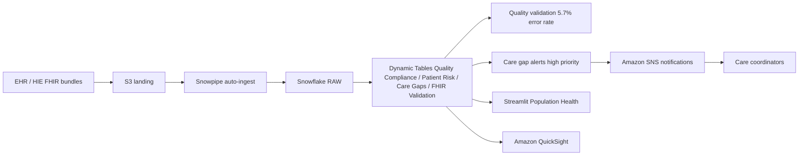

# Healthcare Data Integration — FHIR + Population Health

End-to-end population health analytics platform integrating FHIR-compliant clinical data with quality measure tracking, care gap identification, and proactive patient outreach.

## Architecture

A FHIR + population-health analytics platform built on **Snowflake** (Snowpipe, Dynamic Tables, semantic view) and **AWS** (S3, SNS, QuickSight). FHIR bundles auto-ingest from S3; Dynamic Tables score quality and care gaps; SNS pushes high-priority outreach to care coordinators.



## Snowflake Capabilities

| Capability | Implementation |
|-----------|---------------|
| Dynamic Tables | Quality Compliance / Patient Risk / Care Gaps / FHIR Validation |
| ML Functions | ML.FORECAST admission volume by facility |
| Cortex Search | 100 clinical care pathway documents indexed |
| Cortex Agent | PopulationHealthAnalyst + CarePathwaySearch tools |
| Semantic View | Structured analytics over quality measures and care gaps |
| Streamlit | Population health dashboard with compliance tracking |
| Snowpipe | Auto-ingest FHIR bundles from S3 |

## AWS Services

| Service | Role in Demo |
|---------|-------------|
| Amazon S3 | Landing zone for FHIR bundles from EHR/HIE systems |
| Amazon SNS | Push high-priority care gap alerts to coordinators |
| Amazon QuickSight | Executive quality and compliance dashboard |

## Personas

| Persona | Role | Key Questions |
|---------|------|---------------|
| **Population Health Director** | Quality programs and care coordination | "Which quality measures are below target?" "Who needs outreach?" |
| **Chief Medical Officer (CMO)** | System-wide quality and compliance | "What's our diabetes control rate?" "Are we HEDIS-compliant?" |

## Data

| Table | Rows | Description |
|-------|------|-------------|
| PATIENTS | 5,000 | APJ-region names, risk tiers (Critical/High/Medium/Low) |
| ENCOUNTERS | 53,000 | 50K valid + 3K with deliberate FHIR validation errors |
| CONDITIONS | 30,000 | Diabetes, Hypertension, COPD, Heart Failure, CKD, Asthma |
| OBSERVATIONS | 80,000 | HbA1c, BP, BMI, eGFR — 62% diabetes control rate |
| CARE_PLANS | 10,000 | Active plans linked to patients and conditions |
| QUALITY_MEASURES | 20 | HEDIS/CMS measures with compliance targets |
| CARE_PATHWAY_DOCS | 100 | Clinical pathways for Cortex Search |

## Build Instructions

### Prerequisites
- Snowflake account with ACCOUNTADMIN access
- Cortex AI enabled (ML Functions, Search, Agent)
- Warehouse: CORTEX (Medium)
- AWS CLI with SNS, QuickSight access

### Deployment

```bash
snowsql -f snowflake/00_setup.sql
snowsql -f snowflake/01_integrations.sql
snowsql -f snowflake/02_raw_tables.sql
snowsql -f snowflake/03_curated.sql
snowsql -f snowflake/04_search.sql
snowsql -f snowflake/05_ml.sql
snowsql -f snowflake/06_semantic.sql
snowsql -f snowflake/07_agent.sql
snowsql -f snowflake/08_alerts.sql
```

### Streamlit App
```
HEALTHCARE_INTEGRATION.APP.POPULATION_HEALTH_APP
```

## Build Modes

### Snowflake Only
Run the SQL scripts in `snowflake/` (skip `01_integrations.sql`) and deploy the Streamlit app from `streamlit/deploy/`. Uses Cortex AI instead of Bedrock, and Snowflake Intelligence instead of QuickSight.

### Full AWS + Snowflake
Run all SQL scripts including `01_integrations.sql`, deploy the main Streamlit app from `streamlit/`, then run the QuickSight setup from `quicksight/`.

## Business Impact

Industry research and Snowflake customer outcomes:
- **Reducing readmissions by 1%** saves $2.3M/year per hospital system -- CMS data
- **FHIR interoperability** saves $1.2M/year per health system in reduced integration costs -- KLAS Research
- **Care gap closure** improves quality scores by 15-25% and reduces penalties -- Industry benchmark
- **Sanofi** (Snowflake customer): real-world clinical data platform processes 100M records in minutes -- [snowflake.com/customers/sanofi](https://www.snowflake.com/en/customers/all-customers/case-study/sanofi/)
- **AMN Healthcare** achieved 99.9% pipeline success rate and 75% faster runtime after switching to Snowflake -- [snowflake.com/customers/amn-healthcare](https://www.snowflake.com/en/customers/all-customers/case-study/amn-healthcare/)

## Key Demo Numbers

- **Diabetes HbA1c Control** — 62% compliance (target 80%), 682 patients in gap
- **Readmission Rate** — 15% for diabetes patients (vs 7% overall)
- **FHIR Error Rate** — 5.7% (missing references, invalid codes, bad date sequences)
- **SNS alerts** — high-priority care gaps pushed to coordinators in real-time

## License

Apache 2.0 — See [LICENSE](LICENSE) for details.

This is a personal demo project and is not an official Snowflake offering. It comes with no support or warranty. Industry metrics cited are from publicly available third-party research and Snowflake customer stories; they represent reported outcomes and are not guarantees of results.
