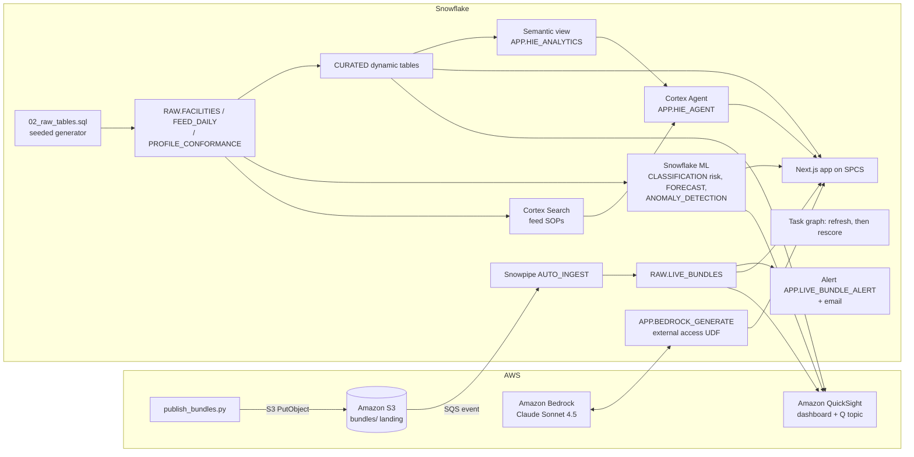

# APJ Health Information Exchange - FHIR Feed Integration Operations

End-to-end FHIR feed operations for **40 connected facilities in a fictional regional health information exchange across 5 APJ markets** (Singapore, Sydney, Seoul, Tokyo, Taipei) using Snowflake, optionally with AWS: from a live bundle delivery alert to a 7-day interface incident risk score, an alert email and an AI action memo for the data integration team. The exchange's feeds are the inputs that population health analytics depend on. All data is synthetic and facility-level: there are no patient records and no clinical content.

## Architecture

A feed integration pipeline built on **Snowflake** (Dynamic Tables, Snowflake ML, Cortex Search, Cortex Agent, Cortex AI_COMPLETE, SPCS) and, in the full build, **AWS** (Amazon S3, Bedrock Claude, QuickSight + Amazon Q). Bundle delivery events land in `RAW.LIVE_BUNDLES`. Dynamic tables curate 90 days of facility-day history: FHIR bundles received and accepted against the expected volume, data quality issues by type, interface incidents, remediation tickets, conformance check compliance and FHIR profile conformance. Snowflake ML scores 7-day interface incident risk per facility, forecasts network-wide accepted bundles and flags unmapped code rate anomalies. A Cortex Agent answers questions with SOP citations, and an LLM drafts the integration team's action memo.

Interactive diagrams (hover for object names): [Snowflake only](docs/architecture-snowflake.html) | [AWS + Snowflake](docs/architecture-aws.html). The app shows both on its Architecture & Data tab, the current build first. Regenerate them with `python3 docs/build_architecture.py`.


```mermaid
flowchart LR
    subgraph AWS
      SIM[publish_bundles.py] -->|S3 PutObject| S3[(Amazon S3<br/>bundles/ landing)]
      BR[Amazon Bedrock<br/>Claude Sonnet 4.5]
      QS[Amazon QuickSight<br/>dashboard + Q topic]
    end
    subgraph Snowflake
      S3 -->|SQS event| PIPE[Snowpipe AUTO_INGEST] --> LIVE[RAW.LIVE_BUNDLES]
      GEN[02_raw_tables.sql<br/>seeded generator] --> RAW[RAW.FACILITIES / FEED_DAILY<br/>/ PROFILE_CONFORMANCE]
      RAW --> DT[CURATED dynamic tables]
      RAW --> ML[Snowflake ML<br/>CLASSIFICATION risk, FORECAST,<br/>ANOMALY_DETECTION]
      DT --> SV[Semantic view<br/>APP.HIE_ANALYTICS]
      RAW --> CS[Cortex Search<br/>feed SOPs]
      SV --> AG[Cortex Agent<br/>APP.HIE_AGENT]
      CS --> AG
      LIVE --> AL[Alert APP.LIVE_BUNDLE_ALERT<br/>+ email]
      UDF[APP.BEDROCK_GENERATE<br/>external access UDF]
      TK[Task graph: refresh, then rescore]
      APP[Next.js app on SPCS]
    end
    BR <--> UDF
    DT --> APP
    ML --> APP
    LIVE --> APP
    AG --> APP
    UDF --> APP
    DT --> QS
    ML --> QS
    LIVE --> QS
```

The Snowflake-only build drops the AWS subgraph: `APP.SIMULATE_BUNDLES` writes to `RAW.LIVE_BUNDLES`, and the app calls Cortex `AI_COMPLETE` instead of the Bedrock UDF.

## Snowflake Capabilities

| Capability | Implementation |
|-----------|---------------|
| Dynamic Tables | `CURATED.KPI_SUMMARY`, `PERFORMANCE_SUMMARY`, `ISSUE_SUMMARY`, `TREND_ANALYSIS` from the RAW tables |
| Snowflake ML | CLASSIFICATION 7-day interface incident risk (`ML.INCIDENT_RISK_SCORES`), 14-day accepted-bundle FORECAST, unmapped code rate ANOMALY_DETECTION |
| Cortex Search | 13 synthetic feed operations SOPs (one per source type and data quality issue type) in `SEARCH.FEED_SOP_SEARCH` |
| Semantic View | `APP.HIE_ANALYTICS` over facilities, issue types, daily totals and risk |
| Cortex Agent | `APP.HIE_AGENT`: Cortex Analyst over the semantic view plus Cortex Search for SOP citations |
| Cortex AI | `AI_COMPLETE('claude-sonnet-4-5')` for grounded answers, and for the action memo in the Snowflake-only build |
| Alerts + Tasks | `APP.LIVE_BUNDLE_ALERT` logs ALERT events and sends email; task graph `TASK_REFRESH_CURATED`, then `TASK_RESCORE_RISK` |
| Snowpark Container Services | Next.js app `APP.APJ_HIE_APP` with 6 tabs: Executive Cockpit, Predictive, Conformance, Live Bundles, Ask AI, Architecture & Data |
| Snowpipe | `RAW.LIVE_BUNDLES_PIPE` AUTO_INGEST from S3 (AWS build only) |

## AWS Services

Used only in the AWS + Snowflake build.

| Service | Role in Demo |
|---------|-------------|
| Amazon S3 | Landing bucket (`bundles/`). `aws/publish_bundles.py` uploads each batch of simulated bundle delivery events with PutObject, and an event notification goes to the Snowpipe SQS queue |
| Amazon Bedrock | Claude Sonnet 4.5 writes the action memo, called from Snowflake through an external-access UDF |
| Amazon QuickSight | DIRECT_QUERY executive dashboard over Snowflake (daily accepted bundles and issues, interface incidents by facility, incident risk) |
| Amazon Q | Natural-language questions over the QuickSight topic `apj-hie-topic` |
| AWS IAM | Least-privilege roles for S3 and Bedrock |

## Personas

These personas are fictional.

| Persona | Role | Key Questions |
|---------|------|---------------|
| **Hana Lim** | Head of Data Integration | "Are facilities sending the volume we expect?" "Which issue types turn into interface incidents?" |
| **Ravi Menon** | Interface Operations Lead | "Which facilities are high risk this week, and which SOP applies?" |

## Data

All data is synthetic and seeded, so every rebuild reproduces it. The exchange, facilities and names are fictional. Tables hold facility-level daily counts only: there are no patient records, no patient identifiers and no clinical content, and nothing in this demo is a clinical or medical claim. FHIR appears only as generic resource and profile names.

| Table | Rows | Description |
|-------|------|-------------|
| RAW.FACILITIES | 40 | Connected facilities across 5 markets and 5 source types (Hospital, Primary care, Laboratory, Pharmacy, Imaging), with integration tier and 90-day expected bundle volume |
| RAW.FEED_DAILY | 3,600 | Daily facility observations over 90 days: FHIR bundles received and accepted, data quality issues, interface incidents, remediation tickets, issue type, conformance checks, unmapped code rate and feed latency |
| RAW.PROFILE_CONFORMANCE | 40 | Required, conformant and pending FHIR profiles for each facility's main resource type |
| SEARCH.FEED_SOP_DOCS | 13 | Synthetic feed operations SOPs indexed for Cortex Search |
| RAW.LIVE_BUNDLES | Grows during the demo | Live bundle delivery events from S3 (AWS build) or `APP.SIMULATE_BUNDLES` (Snowflake-only build) |
| ML.INCIDENT_RISK_SCORES | 40 | 7-day interface incident probability and risk band per facility |

## Build Instructions

### Prerequisites
- Snowflake account with ACCOUNTADMIN access, and Cortex AI enabled (AI_COMPLETE, Search, Agent).
- An X-Small warehouse with auto-suspend at or below 120 s, and an existing SPCS compute pool.
- Python 3.11+, `snowflake-connector-python`, Node.js 22+, Docker and the `snow` CLI.
- App image: run `snow spcs image-registry login`, then build and push `apj-hie-app:v1` to the database's `APP.IMAGES` repository (see the header of `snowflake/07_deploy_app.sql`).
- AWS build only: `boto3`, AWS credentials for the target account (us-west-2) with Bedrock access, and QuickSight Enterprise.

### SPCS App
```
<DATABASE>.APP.APJ_HIE_APP
```

### Tests
```bash
python -m pytest aws snowflake quicksight
```

For a local run, put `SNOWFLAKE_ACCOUNT`, `SNOWFLAKE_USER`, `SNOWFLAKE_DATABASE`, `SNOWFLAKE_WAREHOUSE`, `SNOWFLAKE_AUTHENTICATOR=PROGRAMMATIC_ACCESS_TOKEN`, `SNOWFLAKE_TOKEN` and `DEMO_PLATFORM` in the environment, then run `npm --prefix app run build && npm --prefix app start`.

## Build Modes

Both modes share the same core. They differ in three places, and the app's `DEMO_PLATFORM` setting (in its SPCS spec) switches the memo provider and the Live Bundles tab.

| Layer | Snowflake Only | Full AWS + Snowflake |
|---|---|---|
| Live bundle events | `CALL APP.SIMULATE_BUNDLES(n)` inserts simulated bundle delivery events into `RAW.LIVE_BUNDLES`. This simulates an interface engine feed; it is not Snowpipe Streaming | `aws/publish_bundles.py` uploads a batch to S3 with PutObject, then SQS and Snowpipe AUTO_INGEST |
| Action memo | Cortex `AI_COMPLETE('claude-sonnet-4-5')` | Amazon Bedrock Claude Sonnet 4.5 through `APP.BEDROCK_GENERATE` |
| BI and natural-language questions | The SPCS app is the dashboard; questions go to the Cortex Agent | Also a QuickSight dashboard and an Amazon Q topic |
| App setting | `DEMO_PLATFORM: snowflake` | `DEMO_PLATFORM: aws` |

### Snowflake Only

```bash
# 1. Core data and dynamic tables (guarded: new isolated database only)
python snowflake/run_core.py --database APJ_HEALTH_INTEGRATION_SNOWFLAKE --warehouse <XS_WAREHOUSE> --connection <CONNECTION> --apply
# 2. Native bundle feed, ML, search, semantic view, agent, alert and task graph
python snowflake/run_intelligence.py --database APJ_HEALTH_INTEGRATION_SNOWFLAKE --platform snowflake --warehouse <XS_WAREHOUSE> --connection <CONNECTION> --alert-email you@example.com
# 3. App on SPCS with DEMO_PLATFORM=snowflake (push the image first)
python snowflake/run_intelligence.py --database APJ_HEALTH_INTEGRATION_SNOWFLAKE --platform snowflake --warehouse <XS_WAREHOUSE> --connection <CONNECTION> --alert-email you@example.com --files 07_deploy_app.sql --compute-pool <COMPUTE_POOL>
```

During the demo:
- Run `CALL APP.SIMULATE_BUNDLES(20)` to add live bundle delivery events. For a continuous feed, run `ALTER TASK APP.TASK_SIMULATE_BUNDLES RESUME`, and `SUSPEND` it afterwards.
- Run `EXECUTE ALERT APP.LIVE_BUNDLE_ALERT` to raise the alert email.
- Run `EXECUTE TASK APP.TASK_REFRESH_CURATED` to refresh the curated tables and rescore risk.

Afterwards, drop the database or run `ALTER SERVICE APP.APJ_HIE_APP SUSPEND`.

### Full AWS + Snowflake

```bash
# 1. Core data and dynamic tables (guarded: new isolated database only)
python snowflake/run_core.py --database APJ_HEALTH_INTEGRATION_AWS --warehouse <XS_WAREHOUSE> --connection <CONNECTION> --apply
# 2. AWS ingestion and Bedrock (dry run first, then --apply)
python aws/setup_aws.py --database APJ_HEALTH_INTEGRATION_AWS --account <AWS_ACCOUNT_ID> --connection <CONNECTION> --apply
# 3. ML, search, semantic view, agent, alert and task graph
python snowflake/run_intelligence.py --database APJ_HEALTH_INTEGRATION_AWS --platform aws --warehouse <XS_WAREHOUSE> --connection <CONNECTION> --alert-email you@example.com
# 4. App on SPCS with DEMO_PLATFORM=aws (push the image first)
python snowflake/run_intelligence.py --database APJ_HEALTH_INTEGRATION_AWS --platform aws --warehouse <XS_WAREHOUSE> --connection <CONNECTION> --alert-email you@example.com --files 07_deploy_app.sql --compute-pool <COMPUTE_POOL>
# 5. QuickSight dashboard and Q topic (needs an existing Snowflake data source)
python quicksight/build_dashboards.py --database APJ_HEALTH_INTEGRATION_AWS --account <AWS_ACCOUNT_ID> --principal-arn <QUICKSIGHT_USER_ARN> --data-source-arn <DATA_SOURCE_ARN> --prefix apj-hie --apply --update --with-topic
```

QuickSight objects must be shared with the QuickSight user who signs in (`--principal-arn`); otherwise the console shows nothing.

During the demo:
- Run `python aws/publish_bundles.py --account <AWS_ACCOUNT_ID> --count 20` to upload live bundle delivery events. Snowpipe loads each object within about a minute.
- Run `EXECUTE ALERT APP.LIVE_BUNDLE_ALERT` to raise the alert email.
- Run `EXECUTE TASK APP.TASK_REFRESH_CURATED` to refresh the curated tables and rescore risk.

Afterwards, `python aws/teardown_aws.py --database APJ_HEALTH_INTEGRATION_AWS --account <AWS_ACCOUNT_ID> --connection <CONNECTION> --apply` removes the AWS resources and the account-level Bedrock external-access and S3 storage integrations. It leaves the email integration `APJ_HIE_EMAIL_INT`, which the Snowflake-only build also uses.

## Business Impact

Snowflake customer outcomes:
- **AMN Healthcare** (Snowflake customer) rearchitected its data environment with Snowflake and Microsoft Azure Data Factory: a 99.9% pipeline success rate and a 75% reduction in data warehouse runtime, with an estimated $2.2 million in annual savings while storing about 50% more data -- [Snowflake customer story: AMN Healthcare](https://www.snowflake.com/en/customers/all-customers/case-study/amn-healthcare/)

## Key Demo Numbers

These figures are synthetic and come from the seeded demo data.

- **40 facilities**, 3,600 facility-days over 90 days, across 5 markets and 5 source types
- **464,274 FHIR bundles accepted** against 499,054 expected, so feed completeness is **93.0%**; 11 facilities are below 90% of their expected volume. 494,693 bundles received, a 6.1% bundle rejection rate
- **573 data quality issues** raised and **174 escalated** as interface incidents, a 30.4% issue escalation rate; **71 remediation tickets** opened
- **Date sequence error** produces the most interface incidents (58 of 159 issues); the 16 regional network outage issues are never escalated
- **Interface incident model** out-of-time holdout: precision 0.36, recall 0.20 at a 0.5 threshold, against a 0.25 base rate. Eight facilities are high risk; the top facility is FAC-0020, at 94.7%
- **14-day accepted-bundle forecast** of 5,007 to 5,156 bundles per day, with prediction intervals; **54 of 640** facility-days flagged as unmapped code rate anomalies. The data is identical on every build, but dates are relative to the build day, so these two figures can shift slightly with the weekday
- **Conformance check compliance 82.2%**, FHIR profile conformance 58.0%, with 24 profile reviews pending
- **13 SOPs** indexed for Cortex Search and cited by ID in agent answers

## License

Apache 2.0 — See [LICENSE](LICENSE) for details.

This is a personal demo project and is not an official Snowflake offering. It comes with no support or warranty. It uses synthetic data only and provides no medical, clinical or regulatory advice. Customer outcomes cited are from publicly available Snowflake customer stories; they represent reported outcomes and are not guarantees of results.
